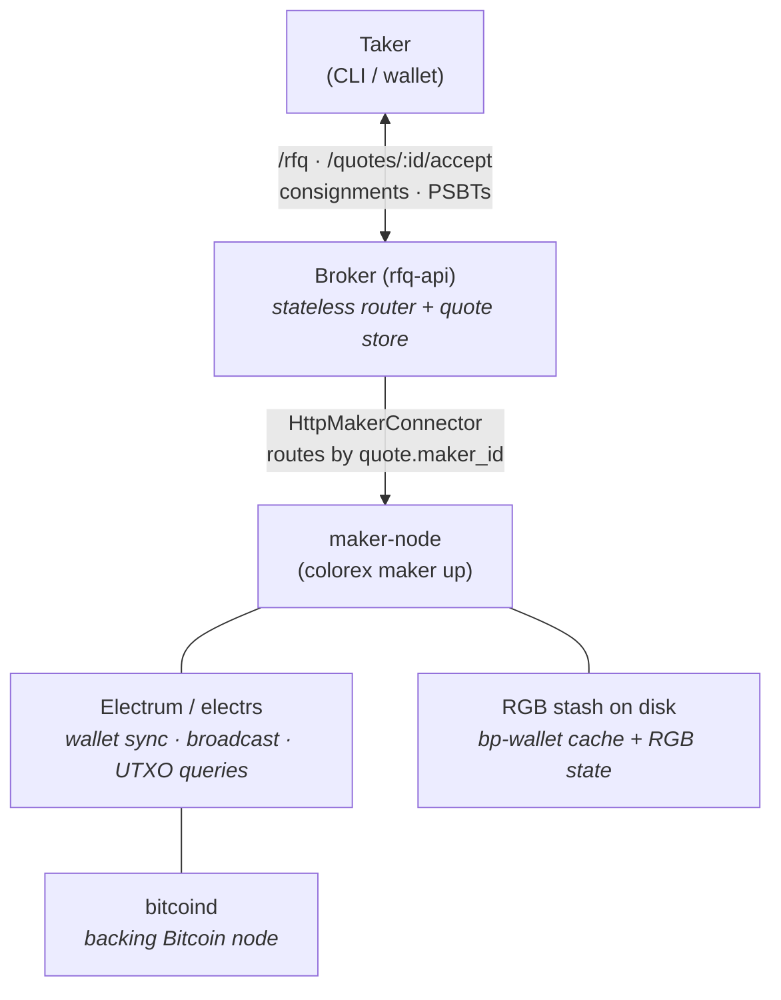
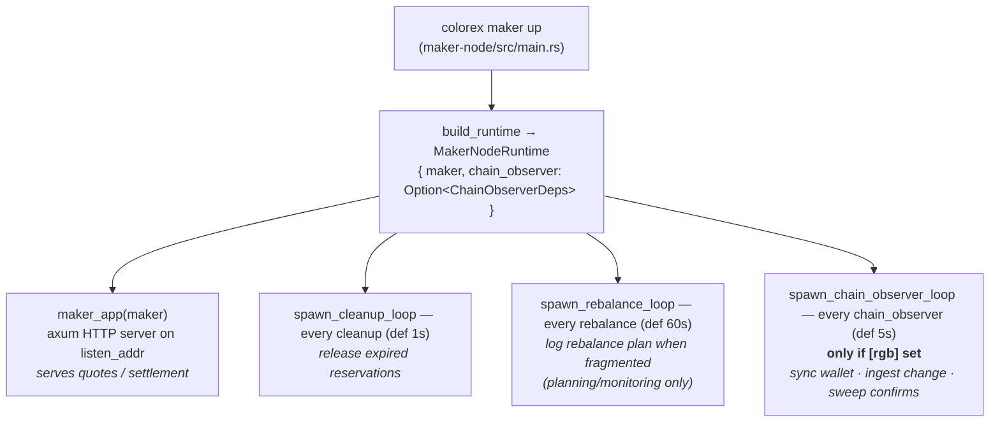
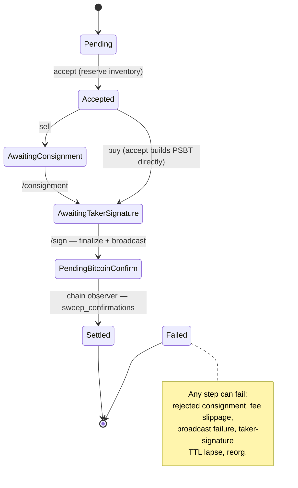

# Maker-Node Architecture

This document describes the architecture of the **maker-node** — the daemon
that serves RGB↔BTC swap quotes and settles them on Bitcoin. The binary is
`colorex` (crate `maker-node`); its swap logic lives in `rfq-maker`, and its
RGB/Bitcoin I/O lives behind trait boundaries in `rfq-rgb` and `rfq-btc`.

It is the counterpart to the **broker** (`rfq-api`) and the **taker** (the swap
counterparty). See [swap-flows.md](swap-flows.md) for the protocol and the
[README](../README.md) for the operator CLI + setup quickstart.

---

## 1. Where the maker-node sits

The maker-node never talks to takers directly. A broker fans RFQs out to one or
more maker-nodes over HTTP and routes the follow-up calls back to whichever
maker quoted (matching on `quote.maker_id`).



The broker holds **no** inventory or keys; it is a stateless router plus an
in-memory quote store. All value, keys, and RGB state live in the maker-node.

---

## 2. The runtime: one Maker + background loops

`colorex maker up` builds a `MakerNodeRuntime` and runs an HTTP server plus
background loops, all sharing the same `Maker` (cheaply cloned — its fields are
`Arc`-backed).



All four boxes share the same `Arc`-backed `Maker`. Key symbols (in
`crates/maker-node/src/lib.rs`): `MakerNodeRuntime`
[:262](../crates/maker-node/src/lib.rs#L262), `ChainObserverDeps`
[:270](../crates/maker-node/src/lib.rs#L270), `build_runtime`
[:281](../crates/maker-node/src/lib.rs#L281), `maker_app`
[:396](../crates/maker-node/src/lib.rs#L396), `spawn_cleanup_loop`
[:524](../crates/maker-node/src/lib.rs#L524), `spawn_rebalance_loop`
[:543](../crates/maker-node/src/lib.rs#L543), `spawn_chain_observer_loop`
[:574](../crates/maker-node/src/lib.rs#L574). Daemon assembly: `run()` in
[main.rs:70](../crates/maker-node/src/main.rs#L70).

### Why "a Maker **and** a chain observer"

The `Maker` is driven from **two directions**:

1. **Inbound (request path):** HTTP handlers call into the `Maker` to quote,
   reserve inventory, and build / sign / broadcast PSBTs.
2. **Out-of-band (chain observer):** between requests, the observer pulls
   on-chain reality back into the `Maker` so its wallet + inventory view stays
   fresh.

Without the observer, the maker's UTXO view freezes at startup: change outputs
from a settled swap are never seen, and `PendingBitcoinConfirm` reservations
never advance — so the *second* swap stalls. This loop is the runtime gap that
issue #27 closed.

---

## 3. The Maker (rfq-maker)

`Maker` ([crates/rfq-maker/src/lib.rs:149](../crates/rfq-maker/src/lib.rs#L149))
is the swap brain. It is backend-agnostic — it depends on **traits**, not
concrete RGB/Bitcoin code:

```rust
pub struct Maker {
    maker_id:       MakerId,
    store:          Arc<dyn InventoryStore>,      // RGB UTXO lifecycle
    selector:       Arc<dyn CoinSelector>,        // input selection
    btc_store:      Arc<dyn BtcInventoryStore>,   // plain-BTC payout inventory (sell side)
    rgb_backend:    Arc<dyn RgbBackend>,          // RGB I/O + swap-PSBT composition
    bitcoin_client: Arc<dyn BitcoinClient>,       // Bitcoin I/O (electrum)
    pending:        Arc<RwLock<HashMap<QuoteId, PendingSettlement>>>, // in-flight settlements
}
```

(The *quote* store is **not** on `Maker` — it lives on `MakerNodeState`
alongside the maker, at [lib.rs:391](../crates/maker-node/src/lib.rs#L391).)

The trait boundary is what lets the same `Maker` run two ways:

| Mode           | `rgb_backend`    | `bitcoin_client`    | chain observer | When                                   |
|----------------|------------------|---------------------|----------------|----------------------------------------|
| **Mock**       | `MockRgbBackend` | `MockBitcoinClient` | `None`         | `[rgb]` omitted — broker-wiring tests  |
| **Real (RGB)** | `LibRgbBackend`  | `ElectrumClient`    | `Some(deps)`   | `[rgb]` present — regtest / live        |

`build_runtime` picks the mode from config: `Some(rgb)` → real backend +
electrum + an initial inventory snapshot + `ChainObserverDeps`; `None` → mock
backends seeded with deterministic UTXOs and no observer
([lib.rs:281](../crates/maker-node/src/lib.rs#L281)).

The `RgbBackend` trait (both backends implement it) is in
[crates/rfq-rgb/src/lib.rs](../crates/rfq-rgb/src/lib.rs); the real swap-PSBT
composition is in [crates/rfq-rgb/src/swap.rs](../crates/rfq-rgb/src/swap.rs).

---

## 4. HTTP surface

`maker_app` exposes six endpoints
([crates/maker-node/src/lib.rs:396](../crates/maker-node/src/lib.rs#L396)):

| Method & path                  | Purpose                                                       |
|--------------------------------|--------------------------------------------------------------|
| `GET  /health`                 | Liveness.                                                     |
| `GET  /inventory`              | `InventorySnapshot` (total / available / reserved / spent).  |
| `POST /quotes`                 | Quote an RFQ → `Option<Quote>`.                              |
| `POST /quotes/:id/accept`      | Reserve inventory, begin settlement.                         |
| `POST /quotes/:id/consignment` | **Sell only** — taker delivers RGB consignment.              |
| `POST /quotes/:id/sign`        | Taker-signed PSBT → maker finalizes + broadcasts.           |

The broker mirrors these (minus `/inventory`) and forwards each call to the
maker by matching the stored `quote.maker_id` to a registered connector
(`HttpMakerConnector`, [crates/rfq-router/src/lib.rs](../crates/rfq-router/src/lib.rs)).

---

## 5. Settlement lifecycle

Each settlement reports a `SettlementStatus`
([crates/rfq-types/src/lib.rs](../crates/rfq-types/src/lib.rs)); the reserved
UTXO itself walks the `InventoryStatus` machine in `rfq-store`.



Two loops drive transitions the request path can't:
- **cleanup loop** releases `Reserved` UTXOs whose taker-signature window
  lapsed, returning them to `Available`
  ([lib.rs:524](../crates/maker-node/src/lib.rs#L524)).
- **chain observer** advances `PendingBitcoinConfirm → Settled` via
  `sweep_confirmations`, and ingests swap *change* UTXOs as `Available`.

---

## 6. The chain observer in detail

Spawned only with a real RGB backend. Each tick (default 5s,
[crates/maker-node/src/lib.rs:574](../crates/maker-node/src/lib.rs#L574)) does
four things in order:

```text
loop every intervals.chain_observer:
  1. rgb_backend.sync_wallet()                              # bp-wallet update() vs electrum — the UTXO resync
  2. list_btc_only_utxos()  -> maker.ingest_btc_change_utxos()   # new BTC change -> Available
  3. list_inventory_utxos() -> maker.ingest_rgb_change_utxos()   # new RGB change -> Available
  4. maker.sweep_confirmations()                           # PendingBitcoinConfirm -> Settled once tx confirms
```

Notes:
- The maker's `/sign` deliberately does **not** ingest the swap's change UTXO;
  the observer adds it with `Available` status once `sync_wallet` sees the new
  outpoint. (Pre-emptive ingestion left change stuck in `PendingBitcoinConfirm`
  forever — see #14e.)
- Errors are logged and the loop continues; the next tick retries.
- The first `interval.tick()` is consumed before the loop so the observer starts
  ~one interval after spawn rather than racing the maker's startup snapshot.
- `sync_wallet` is **maker-side only**. The taker runs its own
  `Taker::sync_wallet()` — no daemon syncs the taker's wallet.

---

## 7. Configuration

TOML at `~/.config/colorex/maker.toml` (or `--config <path>`). Full annotated
example: [crates/maker-node/config.toml.example](../crates/maker-node/config.toml.example).

```toml
[maker]
node_id     = "node·7af2"              # advertised to broker; stamped on every quote
listen_addr = "127.0.0.1:4000"
broker_url  = "http://127.0.0.1:3000"

[intervals]                            # humantime; defaults shown
cleanup        = "1s"
rebalance      = "60s"
chain_observer = "5s"

[rebalance]                            # planner thresholds; defaults shown
fragmentation_threshold = 0.7
max_utxo_count          = 50
min_utxo_count          = 3

[rgb]                                  # OMIT this whole section -> mock backend
network      = "regtest"
data_dir     = "~/.local/share/colorex/rgb"   # RGB stash + bp-wallet cache (rgb-cmd layout)
wallet_name  = "maker"
electrum_url = "localhost:50001"
# no contract_id — tradeable assets live in the maker.db registry (`maker contract import`)

[rgb.signer]
account_file = "~/.local/share/colorex/maker.account"  # xpriv-bearing, password-encrypted
password     = ""                                       # empty for regtest
```

The presence of `[rgb]` is the single switch between mock and real mode.
`node_id` is load-bearing: the broker routes settlement calls by matching it.

`colorex` subcommands ([crates/maker-node/src/main.rs:32](../crates/maker-node/src/main.rs#L32)):
`maker init` (generate keypair + write config), `maker up` (run daemon),
`maker health` (probe broker), `maker inventory` (print snapshot).

---

## 8. Crate map

| Crate         | Role                                                                                   |
|---------------|----------------------------------------------------------------------------------------|
| `maker-node`  | `colorex` binary: config, runtime assembly, HTTP app, background loops.                 |
| `rfq-maker`   | `Maker` — quoting, reservations, settlement state machine.                              |
| `rfq-rgb`     | `RgbBackend` trait + `LibRgbBackend`/`MockRgbBackend`; swap-PSBT composition; `Taker`.  |
| `rfq-btc`     | `BitcoinClient` trait + `ElectrumClient`/`MockBitcoinClient`.                           |
| `rfq-store`   | In-memory RGB/BTC inventory + quote stores (lifecycle bookkeeping).                     |
| `rfq-types`   | Shared wire/domain types (`Quote`, `SettlementIntent`, `SettlementStatus`).             |
| `rfq-api`     | Broker: fan-out router + quote store (`app`, `app_with_makers`).                        |
| `rfq-router`  | `MakerConnector` + `HttpMakerConnector` (broker→maker transport).                       |
| `rfq-client`  | `RfqClient` — HTTP client used by takers/tests against the broker.                      |

---

## 9. Design properties worth knowing

- **Backend-agnostic core.** `Maker` knows only the `RgbBackend` + `BitcoinClient`
  traits; mock vs real is a config flag, so the swap logic is unit-tested without
  a chain.
- **Broker holds no value.** Keys, inventory, and RGB state live entirely in the
  maker-node; the broker is a stateless router.
- **Two-direction state.** The request path mutates inventory; the chain observer
  reconciles it against the chain. Both share one `Arc`-backed `Maker`.
- **Mock mode is first-class.** `[rgb]`-less runs exercise the full broker↔maker
  HTTP path with deterministic UTXOs and no daemon-side chain dependency.

---

_See also: [swap-flows.md](swap-flows.md) (buy/sell protocol),
[swap-psbt-design.md](swap-psbt-design.md) (PSBT composition),
[regtest-rgb20-nia-dev-infra.md](regtest-rgb20-nia-dev-infra.md) (running it on
regtest)._
