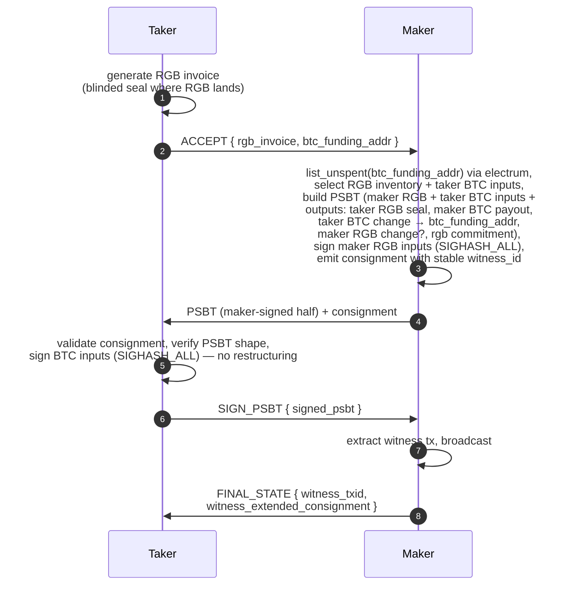
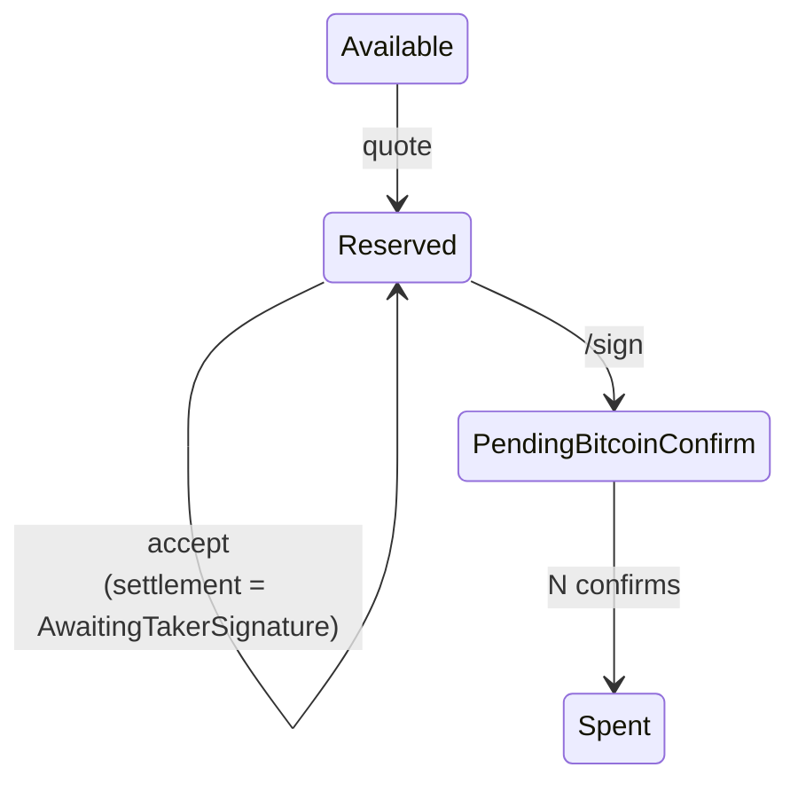
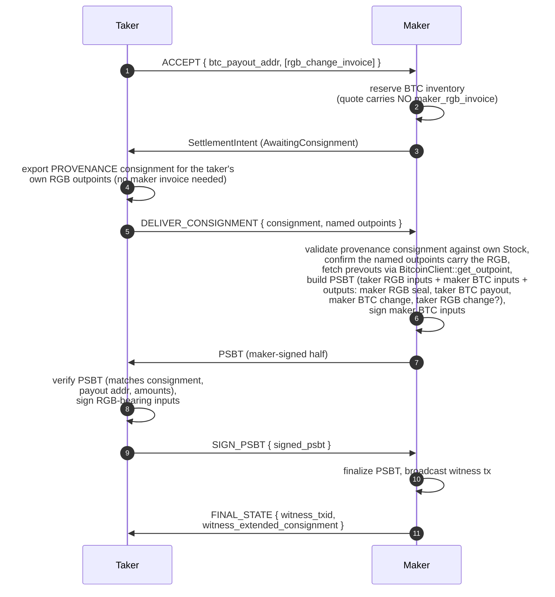
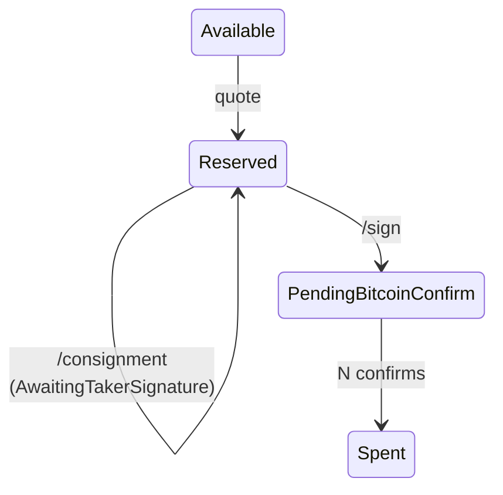
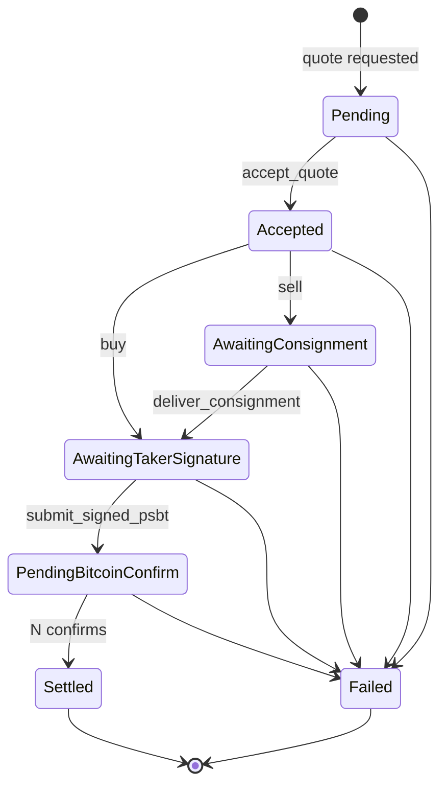

# BTC ↔ RGB Atomic Swap Flows

This document is the canonical spec for the buy-side (taker buys RGB with BTC) and sell-side (taker sells RGB for BTC) settlement flows used by the rfq broker / maker stack. Implementation work is tracked in [#15](https://github.com/pxr64/rfq/issues/15) (buy) and [#16](https://github.com/pxr64/rfq/issues/16) (sell), with sub-issues [#17–#19](https://github.com/pxr64/rfq/issues/17) and [#20–#22](https://github.com/pxr64/rfq/issues/20).

## Protocol invariant

> **Maker constructs the PSBT and broadcasts in both flows.** On the **buy** side the taker (the RGB receiver) creates an RGB invoice. On the **sell** side the maker mints **nothing** — the taker proves the RGB it's selling with a **provenance consignment** for its own outpoints (see [provenance-consignment-proposal.md](provenance-consignment-proposal.md)).

- Buy side: taker is the RGB receiver → taker generates the invoice; the RGB lands on the taker's seal.
- Sell side: the maker mints no invoice. The taker exports a **provenance consignment** for the RGB outpoints it is selling and names them on the wire; the maker receives the RGB on a fresh maker-controlled output of the swap tx.
- In both flows the maker assembles the PSBT (it's the party with simultaneous visibility into RGB inventory, BTC inventory where needed, and chain state).
- In both flows the **maker broadcasts** the final witness transaction. The taker always returns a signed PSBT back to the maker; the maker is the broker's single broadcast point.

## Buy side: taker buys RGB with BTC

### Key properties

- **Declared funding, not declared inputs.** The taker sends a single `btc_funding_addr` in `ACCEPT`. The maker calls `BitcoinClient::list_unspent(addr)` to discover that address's UTXOs and runs `GreedyLargestFirstSelector` to pick enough to cover `quote.price + actual_fee_sats`. Taker BTC change goes back to the same `btc_funding_addr`. This trades a small privacy concession (maker sees the funding address) for substantially simpler wallet integration: the taker's signer only ever sees "sign these inputs," never "compose a new input set + change output."
- **Input set is final at step 3.** All inputs (maker RGB + taker BTC) are present when the maker signs at PSBT-build time, so SIGHASH_ALL works for every input. Witness txid is stable from step 3 — the maker stamps `PendingBitcoinConfirm` on its RGB reservation and ships a real consignment (with the correct witness_id) at step 4.
- **Taker pays the fee, by construction.** Maker BTC payout output = `quote.price`. Taker BTC change output = `sum(selected_taker_btc_inputs) − quote.price − actual_fee_sats`. The maker computes the exact fee at PSBT-build (no taker-side fee math).
- **Taker runs the mined-ancestry gate before signing (step 6).** "Validate consignment" is not just a graph check — the taker calls `validate_buy_consignment` to confirm the maker's RGB inventory ancestry is mined on-chain before it signs away BTC. See [Consignment validation](#consignment-validation-mined-ancestry-gate).

### Inventory transitions (maker side)

Failure transitions: `mark_broadcast_failed` (release) at any pre-broadcast failure; `mark_reorged` if the witness tx gets dropped.

## Sell side: taker sells RGB for BTC

Uses the **provenance model**: the maker mints no invoice; the taker exports a
provenance consignment for its own RGB outpoints and names them. The maker still
needs that consignment before it can build the PSBT inputs, so there's an extra
round trip after `accept` vs. the buy side.

### Key properties

- **No maker invoice — provenance instead.** The maker mints nothing on the sell side (`maker_rgb_invoice` is `None`) and needs no spare anchor. The taker exports a **provenance consignment** for the RGB outpoints it already holds and names them on the wire; the RGB lands on a fresh maker-controlled output the maker adds when it builds the PSBT. See [provenance-consignment-proposal.md](provenance-consignment-proposal.md).
- **Consignment names the inputs.** The taker's provenance consignment includes the RGB-bearing outpoints it is sending. The maker can't build the PSBT until it has those, which is why there's an extra round trip vs. buy side.
- **Prevout fetch is required.** The consignment names outpoints but doesn't carry `scriptPubKey` or BTC value, which are needed to construct the PSBT inputs. The maker calls `BitcoinClient::get_outpoint` for each.
- **Maker validates consignment in step 6.** Against the maker's Stock, then runs the **mined-ancestry gate** (`validate_incoming_consignment`) before committing any BTC — see [Consignment validation](#consignment-validation-mined-ancestry-gate). This is the symmetric operation to what the taker does in buy-side step 5.
- **Taker pays the fee, by netting from payout.** The taker's BTC payout output value = `quote.price − actual_fee_sats`. Maker's BTC change = `sum(maker_btc_inputs) − quote.price`. Maker reserves `quote.price` gross from BTC inventory.

### Inventory transitions (maker side)

Sell side uses BTC inventory (see [#20](https://github.com/pxr64/rfq/issues/20)) and does not consume RGB inventory.

## Consignment validation (mined-ancestry gate)

Both sides settle BTC atomically against an RGB consignment, so before any value is committed the receiving party must independently confirm the consignment's witness history is **mined on-chain** — not merely well-formed. The RGB library's `validate()` does not give us this on its own, so each money gate runs validation in two passes.

### Why `validate()` alone is insufficient

RGB consensus validity is `{Valid, Warnings}` — there is no "must be mined" outcome, and an unmined witness (`WitnessOrd::Tentative`) still validates as `Valid`. Compounding this, the standard accept path seeds the resolver with the consignment's own transactions via `AnyResolver::add_consignment_txes`, which short-circuits every consignment-carried witness to `Tentative` **without ever querying the indexer** (`rgb-ops .../indexers/any.rs`). The library's own docstring warns this "could allow accepting a consignment containing TXs that have not been broadcasted." A maker (sell) or taker (buy) that trusted `validate()` alone would pay real BTC against a forged-but-unmined RGB history.

Seeding can't simply be dropped, though: on the **buy** side the consignment's terminal witness is the swap tx itself, which is legitimately not broadcast at sign time. An un-seeded `validate()` would fail to resolve it (`ResolverError`) and the graph would never close. So we **seed to validate the graph, then re-check minedness separately** against the chain.

### Two-pass gate

1. **Graph pass (seeded).** `validate()` with a resolver seeded via `add_consignment_txes`, asserting `Validity::Valid`. This proves the cryptography — transition graph, mpc/dbc commitments, seal closing, schema/AluVM — but says nothing about chain depth (every seeded witness reports `Tentative`).
2. **Mined-ancestry pass (chain-only).** A fresh, **un-seeded** `MinedChecker` ([crates/rfq-consignment](../crates/rfq-consignment)) re-resolves every witness in the validator's `tx_ord_map` against electrs and requires each to be **mined to K confirmations**. Any unmined witness rejects the consignment before BTC moves.

Implementation: `LibRgbBackend::validate_buy_consignment` (buy) and `validate_incoming_consignment` (sell) in [crates/rfq-rgb/src/lib_backend.rs](../crates/rfq-rgb/src/lib_backend.rs). The design rationale and original vulnerability write-up live in the consignment-validation hardening plan, and a complementary SPV proof-pack anchoring scheme (so non-indexer verifiers — wallet, ICP canister, broker precheck — can verify the same property) is specified in RFQIP-1; both are internal design notes.

### Buy vs sell

The two gates differ only in which terminal witness is allowed to be unmined:

| | Buy gate (taker, before signing) | Sell gate (maker, at `/consignment`) |
|---|---|---|
| Caller | `validate_buy_consignment` | `validate_incoming_consignment` |
| Exempt witness | the swap tx (`expected_witness_txid`) — the legitimately-unmined terminal hop the taker is about to sign | **none** — the taker's whole provenance ancestry must already be mined |
| Protects against | a malicious maker fabricating inventory ancestry to take taker BTC for nonexistent RGB | a malicious taker selling RGB whose history was never mined |

The asymmetry is a direct consequence of the protocol invariant: on a buy the receiver (taker) hosts the *new* seal on the not-yet-broadcast swap tx, whereas on a sell the provenance consignment carries only RGB the taker *already holds*, all of which must be settled.

### Confirmation depth K

`K` is network-aware (`Network::recommended_confs`): **mainnet 6, testnet 3, signet/regtest 1**.

### Performance + DoS guards

- **Size cap.** The ancestry walk rejects any consignment with more than `DEFAULT_MAX_WITNESSES` (10,000) witnesses before doing any per-witness work — a forged consignment can't exhaust the gate with an enormous fake history.
- **Bury bookmark.** Witnesses confirmed buried (≥ `BURY_DEPTH` = 100 confirmations) by a prior gate run are recorded in a `mined_bookmark` file and skipped on subsequent gates, so deep, stable maker-inventory ancestry isn't re-walked on every trade. A missing/unreadable bookmark just re-checks everything (never less safe).

## Endpoints

The broker exposes four RFQ endpoints (plus existing `/quotes` for quote requests):

| Endpoint | Buy side | Sell side |
|---|---|---|
| `POST /quotes/:id/accept` | Returns PSBT + consignment | Returns `SettlementIntent` (no maker invoice — provenance model) |
| `POST /quotes/:id/consignment` | Not used | Taker submits provenance consignment + named outpoints; returns PSBT |
| `POST /quotes/:id/sign` | Taker submits signed PSBT; returns FINAL_STATE | Taker submits signed PSBT; returns FINAL_STATE |
| `GET  /quotes/:id` | Read current `SettlementIntent` | Same |

`MakerConnector` trait in [crates/rfq-router/src/lib.rs:22-32](../crates/rfq-router/src/lib.rs#L22-L32) gains:

- `deliver_consignment(quote_id, consignment_base64) -> SettlementIntent` — sell side only.
- `submit_signed_psbt(quote_id, signed_psbt_base64) -> SettlementIntent` — both sides.

## Settlement state machine

Each waiting state has a TTL — see Timeouts below. Overlap with [#9](https://github.com/pxr64/rfq/issues/9) (settlement state machine).

## Fee policy — taker pays

`Quote` carries two fields used by both sides:

- `estimated_fee_sats: u64` — maker's quote-time estimate.
- `fee_slippage_bps: u16` — basis points the actual fee may exceed `estimated_fee_sats` before settlement aborts. Default `2000` (20%).

At every PSBT-build moment (buy step 3, sell step 6) the maker re-estimates feerate via `BitcoinClient::estimate_feerate(target_blocks=3)`. If `actual_fee > estimated_fee_sats * (1 + fee_slippage_bps/10000)`, settlement aborts with `ApiError::FeeSlippageExceeded { estimated, actual }` and reservations release.

Regtest default: 5 sat/vbyte static. Real fee oracle is a follow-up.

### Fee math by side

- **Buy.** Maker outputs are exactly `price` + maker change. Taker BTC inputs - taker BTC change - maker payout = network fee. Taker pays purely through the input/change differential.
- **Sell.** Taker BTC payout output = `price - actual_fee_sats`. Maker BTC change output = `sum(maker_btc_inputs) - price`. Maker reserves `price` gross; the taker absorbs fee through reduced payout.

## Timeouts

Three new TTL constants in [crates/rfq-maker/src/lib.rs](../crates/rfq-maker/src/lib.rs), alongside the existing `QUOTE_TTL_MS = 30_000`:

| Constant | Default | Stage |
|---|---|---|
| `CONSIGNMENT_TTL_MS` | 300_000 (5 min) | `AwaitingConsignment` (sell only) |
| `TAKER_SIGNATURE_TTL_MS` | 600_000 (10 min) | `AwaitingTakerSignature` (both sides) |
| `BROADCAST_CONFIRM_TTL_MS` | 7_200_000 (2 hr) | `PendingBitcoinConfirm` |

`SettlementIntent` carries `expires_at_ms` for its current stage. `spawn_cleanup_loop` in [services/maker-node/src/main.rs](../services/maker-node/src/main.rs) polls and transitions expired stages via the appropriate `InventoryStore` failure method.

## Failure-path mapping

All transitions use existing methods on `InventoryStore` ([crates/rfq-store/src/lib.rs:124-181](../crates/rfq-store/src/lib.rs#L124-L181)) plus the parallel `BtcInventoryStore` introduced in [#20](https://github.com/pxr64/rfq/issues/20).

| Trigger | Action | Buy-side RGB reservation | Sell-side BTC reservation |
|---|---|---|---|
| Consignment rejected (sell only) | `mark_broadcast_failed` | n/a | release |
| Taker-signature TTL expires | `mark_broadcast_failed` | release | release |
| Signed PSBT invalid / txid mismatch | `mark_broadcast_failed` | release | release |
| Fee slippage exceeded | `mark_broadcast_failed` | release | release |
| Broadcast RPC fails | `mark_broadcast_failed` | release | release |
| Witness tx reorged | `mark_reorged` | rebroadcast or release | rebroadcast or release |
| Witness tx confirmed | `mark_pending_rgb_acceptance` → `mark_spent` | spent | spent |

`mark_rgb_acceptance_failed` only fires on buy-side RGB inventory after broadcast — BTC inventory has no analogue.

## Wire format

`partial_psbt` and `consignment` fields are **base64**. Convention established by parameter naming `psbt_base64` / `consignment_base64` in [crates/rfq-wallet/src/lib.rs:11,17,19](../crates/rfq-wallet/src/lib.rs#L11). Type-level enforcement (e.g. a `PsbtBase64(String)` newtype) is an open question — v0 keeps `String`.

## Authn

v0: `quote_id` is the only identifier. Anyone who learns it can call `/consignment` or `/sign`. Acceptable for MVP; v1 likely returns a `settlement_token` in the `SettlementIntent` from `accept` that subsequent calls must echo.

## PSBT library and segwit constraint

`crates/rfq-rgb/Cargo.toml` pulls `bp-std` 0.11.1-alpha.2 and `bp-wallet` 0.11.1-alpha.2. The new `rfq-btc` crate ([#18](https://github.com/pxr64/rfq/issues/18)) reuses these — no new PSBT dep.

Segwit-only by design. Non-segwit inputs are rejected at `BitcoinClient::get_outpoint`. The constraint is what makes `expected_witness_txid` pre-computable once all inputs are committed (after `/consignment` on sell side, after `/sign` on buy side).

## References

- [#13](https://github.com/pxr64/rfq/issues/13) — Library-backed `rfq-rgb` adapter (real consignment / PSBT bytes).
- [#14](https://github.com/pxr64/rfq/issues/14) — RGB maker UTXO inventory management (RGB inventory used by buy side).
- [#15](https://github.com/pxr64/rfq/issues/15) — Buy-side parent issue.
- [#16](https://github.com/pxr64/rfq/issues/16) — Sell-side parent issue.
- [#9](https://github.com/pxr64/rfq/issues/9) — Settlement state machine.
