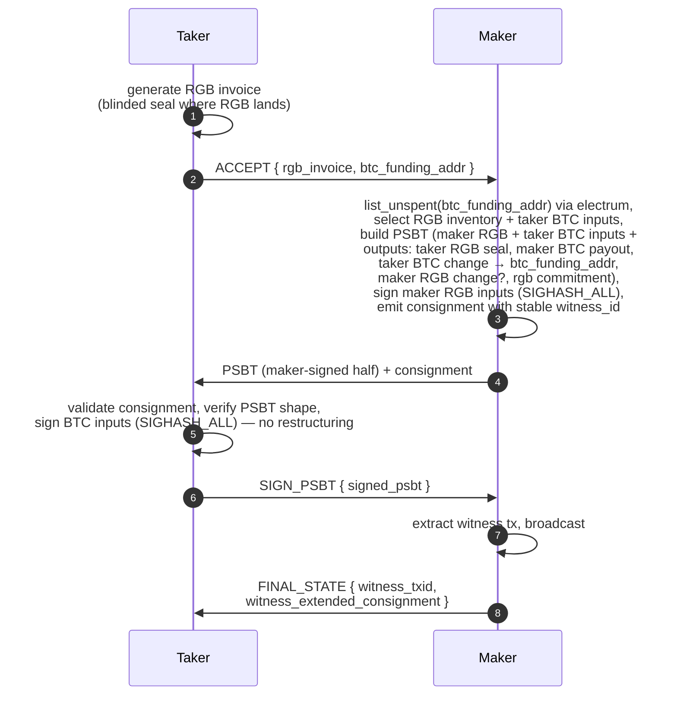
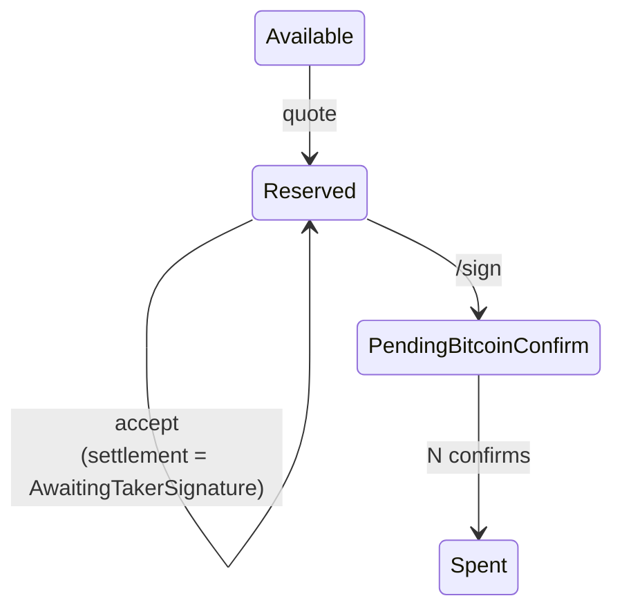
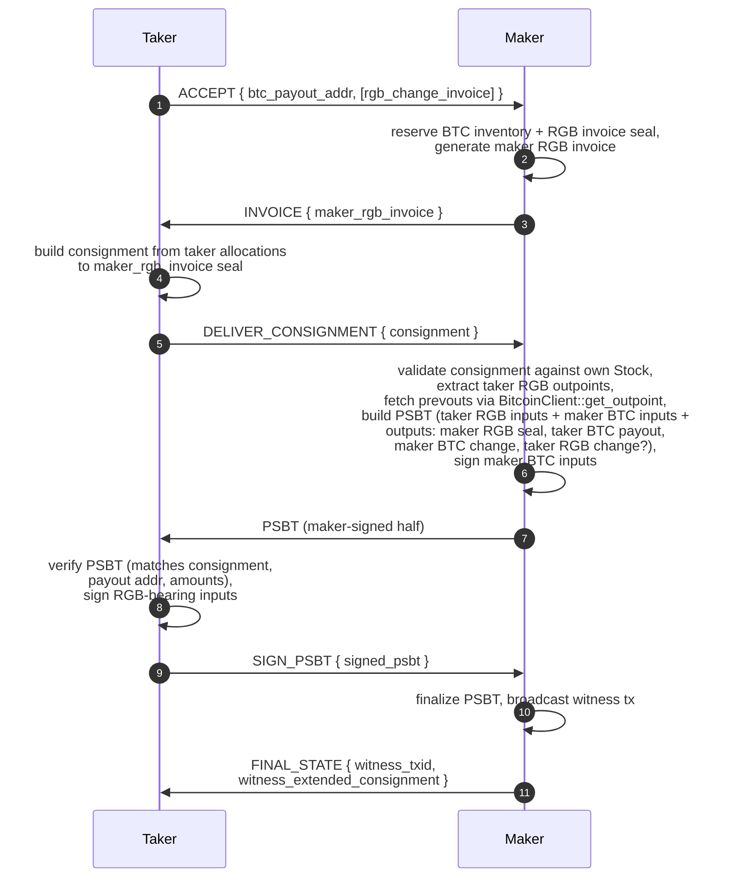
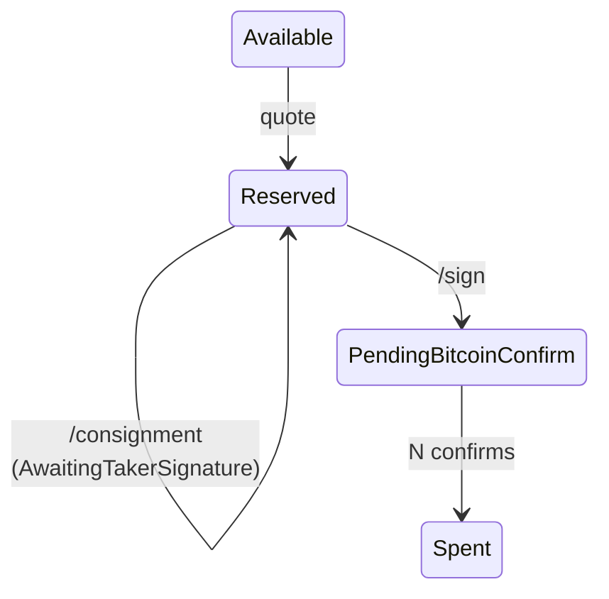
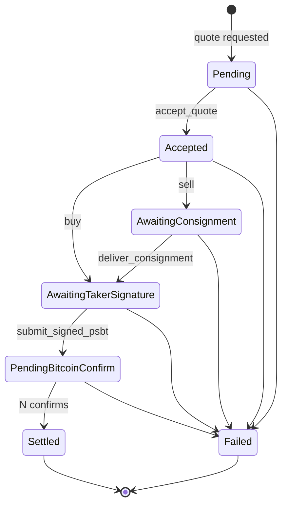

# BTC ↔ RGB Atomic Swap Flows

This document is the canonical spec for the buy-side (taker buys RGB with BTC) and sell-side (taker sells RGB for BTC) settlement flows used by the rfq broker / maker stack. Implementation work is tracked in [#15](https://github.com/pxr64/rfq/issues/15) (buy) and [#16](https://github.com/pxr64/rfq/issues/16) (sell), with sub-issues [#17–#19](https://github.com/pxr64/rfq/issues/17) and [#20–#22](https://github.com/pxr64/rfq/issues/20).

## Protocol invariant

> **Receiver of RGB assets creates the RGB invoice. Maker constructs the PSBT in both flows.**

- Buy side: taker is the RGB receiver → taker generates the invoice.
- Sell side: maker is the RGB receiver → maker generates the invoice.
- In both flows the maker assembles the PSBT (it's the party with simultaneous visibility into RGB inventory, BTC inventory where needed, and chain state).
- In both flows the **maker broadcasts** the final witness transaction. The taker always returns a signed PSBT back to the maker; the maker is the broker's single broadcast point.

## Buy side: taker buys RGB with BTC

### Key properties

- **Declared funding, not declared inputs.** The taker sends a single `btc_funding_addr` in `ACCEPT`. The maker calls `BitcoinClient::list_unspent(addr)` to discover that address's UTXOs and runs `GreedyLargestFirstSelector` to pick enough to cover `quote.price + actual_fee_sats`. Taker BTC change goes back to the same `btc_funding_addr`. This trades a small privacy concession (maker sees the funding address) for substantially simpler wallet integration: the taker's signer only ever sees "sign these inputs," never "compose a new input set + change output."
- **Input set is final at step 3.** All inputs (maker RGB + taker BTC) are present when the maker signs at PSBT-build time, so SIGHASH_ALL works for every input. Witness txid is stable from step 3 — the maker stamps `PendingBitcoinConfirm` on its RGB reservation and ships a real consignment (with the correct witness_id) at step 4.
- **Taker pays the fee, by construction.** Maker BTC payout output = `quote.price`. Taker BTC change output = `sum(selected_taker_btc_inputs) − quote.price − actual_fee_sats`. The maker computes the exact fee at PSBT-build (no taker-side fee math).

### Inventory transitions (maker side)

Failure transitions: `mark_broadcast_failed` (release) at any pre-broadcast failure; `mark_reorged` if the witness tx gets dropped.

## Sell side: taker sells RGB for BTC

Three round trips after `accept` (vs. two on buy side) — the maker needs the consignment before it can build the PSBT inputs.

### Key properties

- **Maker publishes the invoice (step 2-3).** Per the invariant: maker is the RGB receiver on sell side, so it generates the invoice. The invoice binds the contract id, expected amount, and a maker-controlled seal UTXO. A fresh invoice is generated per quote — reusing seals creates a correlation surface.
- **Consignment names the inputs.** The taker's consignment in step 5 includes the RGB-bearing outpoints the taker is sending. The maker can't build the PSBT until it has those, which is why there's an extra round trip vs. buy side.
- **Prevout fetch is required.** The consignment names outpoints but doesn't carry `scriptPubKey` or BTC value, which are needed to construct the PSBT inputs. The maker calls `BitcoinClient::get_outpoint` for each.
- **Maker validates consignment in step 6.** Against the maker's Stock. This is the symmetric operation to what the taker does in buy-side step 5. Real validation lands with [#13](https://github.com/pxr64/rfq/issues/13); mock validation accepts any non-empty consignment except the literal `"rgb-invalid"`.
- **Taker pays the fee, by netting from payout.** The taker's BTC payout output value = `quote.price − actual_fee_sats`. Maker's BTC change = `sum(maker_btc_inputs) − quote.price`. Maker reserves `quote.price` gross from BTC inventory.

### Inventory transitions (maker side)

Sell side uses BTC inventory (see [#20](https://github.com/pxr64/rfq/issues/20)) and does not consume RGB inventory.

## Endpoints

The broker exposes four RFQ endpoints (plus existing `/quotes` for quote requests):

| Endpoint | Buy side | Sell side |
|---|---|---|
| `POST /quotes/:id/accept` | Returns PSBT + consignment | Returns `maker_rgb_invoice` |
| `POST /quotes/:id/consignment` | Not used | Taker submits consignment; returns PSBT |
| `POST /quotes/:id/sign` | Taker submits signed PSBT; returns FINAL_STATE | Taker submits signed PSBT; returns FINAL_STATE |
| `GET  /quotes/:id` | Read current `SettlementIntent` | Same |

`MakerConnector` trait in [crates/rfq-router/src/lib.rs:22-32](../crates/rfq-router/src/lib.rs#L22-L32) gains:

- `deliver_consignment(quote_id, consignment_base64) -> SettlementIntent` — sell side only.
- `submit_signed_psbt(quote_id, signed_psbt_base64) -> SettlementIntent` — both sides.

## Settlement state machine

Each waiting state has a TTL — see Timeouts below. Overlap with [#9](https://github.com/pxr64/rfq/issues/9) (settlement state machine).

## Fee policy — taker pays

`Quote` carries two fields used by both sides:

- `estimated_fee_sats: u64` — maker's quote-time estimate.
- `fee_slippage_bps: u16` — basis points the actual fee may exceed `estimated_fee_sats` before settlement aborts. Default `2000` (20%).

At every PSBT-build moment (buy step 3, sell step 6) the maker re-estimates feerate via `BitcoinClient::estimate_feerate(target_blocks=3)`. If `actual_fee > estimated_fee_sats * (1 + fee_slippage_bps/10000)`, settlement aborts with `ApiError::FeeSlippageExceeded { estimated, actual }` and reservations release.

Regtest default: 5 sat/vbyte static. Real fee oracle is a follow-up.

### Fee math by side

- **Buy.** Maker outputs are exactly `price` + maker change. Taker BTC inputs - taker BTC change - maker payout = network fee. Taker pays purely through the input/change differential.
- **Sell.** Taker BTC payout output = `price - actual_fee_sats`. Maker BTC change output = `sum(maker_btc_inputs) - price`. Maker reserves `price` gross; the taker absorbs fee through reduced payout.

## Timeouts

Three new TTL constants in [crates/rfq-maker/src/lib.rs](../crates/rfq-maker/src/lib.rs), alongside the existing `QUOTE_TTL_MS = 30_000`:

| Constant | Default | Stage |
|---|---|---|
| `CONSIGNMENT_TTL_MS` | 300_000 (5 min) | `AwaitingConsignment` (sell only) |
| `TAKER_SIGNATURE_TTL_MS` | 600_000 (10 min) | `AwaitingTakerSignature` (both sides) |
| `BROADCAST_CONFIRM_TTL_MS` | 7_200_000 (2 hr) | `PendingBitcoinConfirm` |

`SettlementIntent` carries `expires_at_ms` for its current stage. `spawn_cleanup_loop` in [crates/maker-node/src/main.rs](../crates/maker-node/src/main.rs) polls and transitions expired stages via the appropriate `InventoryStore` failure method.

## Failure-path mapping

All transitions use existing methods on `InventoryStore` ([crates/rfq-store/src/lib.rs:124-181](../crates/rfq-store/src/lib.rs#L124-L181)) plus the parallel `BtcInventoryStore` introduced in [#20](https://github.com/pxr64/rfq/issues/20).

| Trigger | Action | Buy-side RGB reservation | Sell-side BTC reservation |
|---|---|---|---|
| Consignment rejected (sell only) | `mark_broadcast_failed` | n/a | release |
| Taker-signature TTL expires | `mark_broadcast_failed` | release | release |
| Signed PSBT invalid / txid mismatch | `mark_broadcast_failed` | release | release |
| Fee slippage exceeded | `mark_broadcast_failed` | release | release |
| Broadcast RPC fails | `mark_broadcast_failed` | release | release |
| Witness tx reorged | `mark_reorged` | rebroadcast or release | rebroadcast or release |
| Witness tx confirmed | `mark_pending_rgb_acceptance` → `mark_spent` | spent | spent |

`mark_rgb_acceptance_failed` only fires on buy-side RGB inventory after broadcast — BTC inventory has no analogue.

## Wire format

`partial_psbt` and `consignment` fields are **base64**. Convention established by parameter naming `psbt_base64` / `consignment_base64` in [crates/rfq-wallet/src/lib.rs:11,17,19](../crates/rfq-wallet/src/lib.rs#L11). Type-level enforcement (e.g. a `PsbtBase64(String)` newtype) is an open question — v0 keeps `String`.

## Authn

v0: `quote_id` is the only identifier. Anyone who learns it can call `/consignment` or `/sign`. Acceptable for MVP; v1 likely returns a `settlement_token` in the `SettlementIntent` from `accept` that subsequent calls must echo.

## PSBT library and segwit constraint

`crates/rfq-rgb/Cargo.toml` pulls `bp-std` 0.11.1-alpha.2 and `bp-wallet` 0.11.1-alpha.2. The new `rfq-btc` crate ([#18](https://github.com/pxr64/rfq/issues/18)) reuses these — no new PSBT dep.

Segwit-only by design. Non-segwit inputs are rejected at `BitcoinClient::get_outpoint`. The constraint is what makes `expected_witness_txid` pre-computable once all inputs are committed (after `/consignment` on sell side, after `/sign` on buy side).

## References

- [#13](https://github.com/pxr64/rfq/issues/13) — Library-backed `rfq-rgb` adapter (real consignment / PSBT bytes).
- [#14](https://github.com/pxr64/rfq/issues/14) — RGB maker UTXO inventory management (RGB inventory used by buy side).
- [#15](https://github.com/pxr64/rfq/issues/15) — Buy-side parent issue.
- [#16](https://github.com/pxr64/rfq/issues/16) — Sell-side parent issue.
- [#9](https://github.com/pxr64/rfq/issues/9) — Settlement state machine.
- [docs/broker-maker-node-roadmap.md](broker-maker-node-roadmap.md) — Roadmap.
- [docs/rebalancing-strategy.md](rebalancing-strategy.md) — RGB inventory rebalancing.
