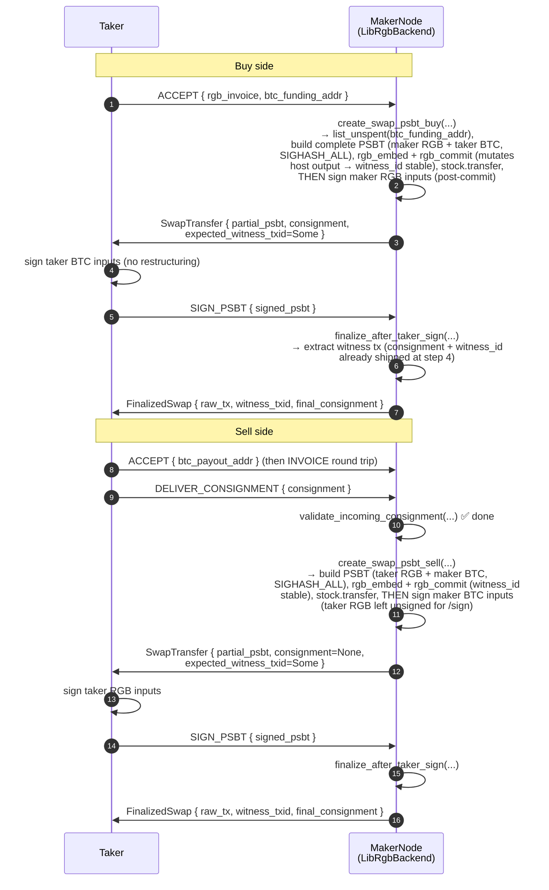

# Atomic-swap PSBT — implementation design

This doc is the **implementation-level** companion to
[`docs/swap-flows.md`](swap-flows.md). Swap-flows specifies *what* the two
parties do at each round trip; this doc specifies *which rgb-api / bp-std
primitives* `LibRgbBackend` calls to make those round trips real, the
SIGHASH model that lets a two-party PSBT survive a sequential signing pipeline,
and the design questions that have to be resolved before any code lands.

Scope: the three stubbed methods on `RgbBackend` that `LibRgbBackend` must
implement to un-mock the swap path.

- `create_swap_psbt_buy(rgb_invoice, amount, &maker_rgb_utxos) -> SwapTransfer`
- `create_swap_psbt_sell(&consignment_info, &taker_rgb_prevouts, &maker_btc_inputs, …) -> SwapTransfer`
- `finalize_after_taker_sign(signed_psbt_base64, original_consignment_base64) -> FinalizedSwap`

## Trait-method timeline

Where each trait method fires in the broader protocol. `MakerNode` is the
process holding `LibRgbBackend`; `Taker` is the counterparty.



The three methods together carry the swap from "taker accepted" to "tx ready
to broadcast." Everything else in the swap flow is already implemented (mock
or real).

## Why this is composition, not a port

`rgb-cmd 0.11.1-rc.6` is the canonical example we've mirrored everywhere
else (`create_invoice`, `validate_incoming_consignment`). It does **not** have
an atomic-swap command — that's literally what we're building. Its `Transfer`
command calls `wallet.pay(invoice, params)`: a single-call **unilateral**
transfer where one wallet supplies every input, pays every output, and signs
SIGHASH_ALL across the whole PSBT.

Atomic swap PSBTs are two-party. There's no convenience wrapper for that
shape; `pay()` covers the unilateral case and stops. But every primitive we
need *is* publicly available — bp-std exposes `Psbt::from_tx` + manual
input/output construction + per-input `sighash_type`, bp-wallet's `psbt.sign(&signer)`
naturally signs only inputs whose keys the signer holds (so partial signing
falls out for free), and rgb-api exposes the RGB transition builder + the
commitment APIs (`stock.transition_builder_raw`, `psbt.rgb_embed`,
`psbt.rgb_commit`, `stock.consume_fascia`, `stock.transfer`).

So Group B is **glue code** that reaches below `pay()` and composes those
primitives into the two-party shape. The work is wiring + design decisions
(SIGHASH model, when to commit the fascia, when to emit the consignment),
not extending the library.

## Inputs / outputs / signing matrix

The shape each side's PSBT must have at every stage of the protocol.

### Buy side

```
PSBT after create_swap_psbt_buy (returned to taker):
  inputs:   [ maker_rgb_in_1, …, maker_rgb_in_N,   ← maker-signed, SIGHASH_ALL
              taker_btc_in_1, …, taker_btc_in_M ]  ← unsigned (taker signs at /sign)
  outputs:  [ taker_rgb_seal,
              maker_btc_payout (= quote.price),
              taker_btc_change (→ btc_funding_addr),
              maker_rgb_change?,
              rgb_commitment ]
  sighashes: every input SIGHASH_ALL — full input set known at build time
  witness_txid: STABLE — emitted as expected_witness_txid + baked into the
                consignment shipped at step 4

PSBT after taker /sign (handed back to maker):
  inputs:   same set, taker BTC inputs now signed
  outputs:  unchanged
  witness_txid: unchanged (witness data isn't in segwit txid)
```

### Sell side

```
PSBT after create_swap_psbt_sell (returned to taker):
  inputs:   [ taker_rgb_in_1, …, taker_rgb_in_N,   ← unsigned (taker signs at /sign)
              maker_btc_in_1, …, maker_btc_in_M ]  ← maker-signed, SIGHASH_ALL
  outputs:  [ maker_rgb_seal, taker_btc_payout, maker_btc_change, taker_rgb_change? ]
  sighashes: maker SIGHASH_ALL works because all inputs present at build time
  witness_txid: stable from here — pre-published as expected_witness_txid

PSBT after taker /sign (handed back to maker):
  inputs:   same set, taker RGB inputs now signed
  outputs:  unchanged
  witness_txid: must equal expected_witness_txid (the maker rejects if it drifts)
```

Both sides converge on **`SIGHASH_ALL` everywhere** because the input set
is final at PSBT-build time on both — buy side discovers taker BTC inputs
via `BitcoinClient::list_unspent(btc_funding_addr)`, sell side has them from
the consignment. The taker only signs the inputs the maker built in for it;
it never restructures the PSBT.

## The PSBT lifecycle per method

### `create_swap_psbt_buy`

Produces a **fully-input-committed PSBT** with the maker's RGB inputs
already signed; the taker only needs to add its signatures to the BTC
inputs the maker built in for it. Near-mirror of `create_swap_psbt_sell`.
Trait signature picks up a new `btc_funding_addr` parameter (lives on
`SwapLeg::Buy`).

```
1. invoice    = RgbInvoice::from_str(rgb_invoice)
2. contract   = invoice.contract                                  // taker's RGB receive
3. wallet     = self.load_wallet()                                // maker side
4. stock      = wallet.stock_mut()
5. // Resolve maker_rgb_utxos to bp-std prevout data (script_pubkey + value_sats)
   //   — walk wallet.coins() for each Outpoint; error if any isn't in the
   //     wallet (the inventory store + the wallet should agree).
6. // Discover the taker's BTC UTXOs by funding address
   taker_utxos = bitcoin_client.list_unspent(btc_funding_addr)?
   actual_fee  = estimate_swap_fee()
   needed      = quote.price + actual_fee
   selection   = GreedyLargestFirstSelector.select(needed, &taker_utxos)?
   // Error → no taker UTXOs cover quote.price + fee
7. // Build the RGB Batch
   builder = stock.transition_builder_raw(contract_id, default_transition_type)
   for each (maker_rgb_outpoint, allocation_state) in resolved_inputs:
       builder = builder.add_input(opout, state)
   builder = builder.add_fungible_state_raw(assignment_type,
                                            BuilderSeal::Concealed(invoice_seal),
                                            amount)
   if sum_inputs > amount:
       maker_change_seal = GraphSeal::with_blinded_vout(change_vout, rand::random())
       builder = builder.add_fungible_state_raw(..., maker_change_seal, sum_inputs - amount)
   main = builder.complete_transition()
   batch = Batch { main, extras: empty }
8. // Build the bp-std PSBT via Psbt::from_tx (see U3).
   //   `Psbt::create` exists too but `Psbt.inputs` is pub(crate); only
   //   from_tx accepts a caller-supplied input set without going through
   //   bp-wallet's PsbtConstructor (which would re-pick funding).
   unsigned_tx = UnsignedTx {
       version: TxVer::V2,
       inputs: maker_rgb_inputs ++ selection.chosen → UnsignedTxIn,
       outputs: [
           TxOut(taker_rgb_seal_script,   Sats::ZERO),           // RGB seal, dust
           TxOut(maker_btc_payout_script, quote.price),          // maker BTC receive
           TxOut(btc_funding_addr_script, taker_change_sats),    // taker BTC change → same addr
           // + TxOut(maker_rgb_change_seal_script, Sats::ZERO) if over-selected
           // + rgb commitment output (opret/tapret) — produced via psbt.set_rgb_close_method
       ],
       lock_time: LockTime::ZERO,
   };
   psbt = Psbt::from_tx(unsigned_tx);
   // Enrich each input through psbt.input_mut(i):
   //   - witness_utxo (the Prevout we already have from inventory + list_unspent)
   //   - sighash_type = SighashType::all_standard()
   //   - for maker-keyed inputs: bip32_derivation + witness_script +
   //     tap_internal_key from maker_descriptor.derive(keychain, idx)
   //   - for taker-keyed inputs: leave bip32 empty; taker's signer scans
   //     its own keys against witness_utxo.script_pubkey at /sign time
   psbt.complete_construction()  // pay.rs:499 — required before rgb_embed
9. // Mark / add the commitment-host output and sort to its canonical position
   //   (mirrors pay.rs:294-325). For opret_first: psbt.construct_output adds
   //   a fresh OP_RETURN placeholder; psbt.set_opret_host() flags it. For
   //   tapret_first: find the existing P2TR change/payout output and
   //   psbt.set_tapret_host() it. Then:
   psbt.set_rgb_close_method(close_method);
   psbt.sort_outputs_by(|o| !o.is_xxx_host());
   psbt.rgb_embed(batch)?
10. // Commit BEFORE signing — rgb_commit mutates the host output's
    //   scriptPubKey (opret payload or taproot key tweak). Signing after
    //   means the maker's sigs commit to the post-commit output set; the
    //   taker, who signs the post-commit PSBT next, does the same.
    let fascia      = psbt.rgb_commit()?
    let witness_id  = psbt.txid();             // stable from here
    stock.consume_fascia(fascia, FasciaResolver { witness_id })?
    let transfer    = stock.transfer(contract_id, [invoice_seal], [], [], Some(witness_id))?
11. // Sign ONLY the maker's RGB inputs. `psbt.sign(&signer)` skips inputs
    //   whose keys the signer doesn't hold — taker BTC inputs left unsigned.
    psbt.sign(&maker_signer)?
12. Return SwapTransfer {
        partial_psbt:           base64(psbt.serialize()),
        consignment:            Some(base64(transfer.save())),
        expected_witness_txid:  Some(witness_id.to_string()),
    }
```

### `create_swap_psbt_sell`

Produces a **fully-input-committed PSBT** (so the witness txid is stable)
where the maker has signed its BTC inputs and the taker has only its RGB
inputs left to sign.

```
1. wallet  = self.load_wallet()
2. stock   = wallet.stock_mut()
3. // Maker RGB receive seal from maker_rgb_invoice
   invoice = RgbInvoice::from_str(maker_rgb_invoice)
   maker_seal = invoice.beneficiary.into_inner()    // BlindedSeal expected
4. // Build the RGB Batch — same pattern as buy, but the "main" transition
   //   is operating on the TAKER's RGB inputs (already in consignment_info)
   //   delivering to maker_seal
   builder = stock.transition_builder_raw(contract_id, default_transition_type)
   for each outpoint in consignment_info.outpoints:
       // Pull the opout + state from the consignment we already validated
       // (we have `validated` in scope from deliver_consignment, but the trait
       //  method only has consignment_info — see "design decision: opout
       //  re-derivation" below)
       builder = builder.add_input(opout, state)
   builder = builder.add_fungible_state_raw(assignment_type,
                                            BuilderSeal::Concealed(maker_seal),
                                            consignment_info.total_amount)
   if rgb_change_invoice.is_some() && consignment_info.total_amount > requested_amount:
       // Taker over-consigned; route the surplus to taker's change invoice
       change_seal = parse(rgb_change_invoice).beneficiary
       builder = builder.add_fungible_state_raw(..., change_seal, surplus)
   main = builder.complete_transition()
   batch = Batch { main, extras: empty }
5. // Build the bp-std PSBT via Psbt::from_tx (same shape as buy — see U3).
   unsigned_tx = UnsignedTx {
       version: TxVer::V2,
       inputs: taker_rgb_prevouts ++ maker_btc_inputs → UnsignedTxIn,
       outputs: [
           TxOut(maker_rgb_seal_script, Sats::ZERO),
           TxOut(btc_payout_addr_script, gross_btc_sats - actual_fee_sats),
           TxOut(maker_btc_change_script, sum(maker_btc_inputs.values) - gross_btc_sats),
           // + TxOut(taker_rgb_change_seal_script, Sats::ZERO) if rgb_change_invoice
           // + rgb commitment output
       ],
       lock_time: LockTime::ZERO,
   };
   psbt = Psbt::from_tx(unsigned_tx);
   // Enrich each input via psbt.input_mut(i):
   //   - witness_utxo, sighash_type = SighashType::all_standard()
   //   - for maker BTC inputs: bip32_derivation + witness_script + tap_internal_key
   //     from maker_descriptor.derive(...)
   //   - for taker RGB inputs: leave bip32 empty; taker fills at /sign
   psbt.complete_construction()
6. psbt.set_rgb_close_method(close_method)
7. psbt.rgb_embed(batch)?
8. // Mark / sort the commitment-host output (same as buy side step 9):
   psbt.set_rgb_close_method(close_method);
   psbt.sort_outputs_by(|o| !o.is_xxx_host());
   psbt.rgb_embed(batch)?
9. // Commit BEFORE signing — rgb_commit mutates the host output's
   //   scriptPubKey, so the maker's signatures need to commit to the
   //   post-commit output set.
   let fascia      = psbt.rgb_commit()?
   let witness_id  = psbt.txid();             // stable from here
   stock.consume_fascia(fascia, FasciaResolver { witness_id })?
   let _own_transfer = stock.transfer(contract_id, [maker_seal], [], [], Some(witness_id))?
   // maker-side transfer captures the new state in the maker's stash; the
   // taker already has its own consignment (the one they submitted in /consignment).
10. // Sign ONLY the maker's BTC inputs (taker RGB inputs left for taker /sign).
    psbt.sign(&maker_signer)?
11. Return SwapTransfer {
        partial_psbt:           base64(psbt.serialize()),
        consignment:            None,                       // taker built theirs
        expected_witness_txid:  Some(witness_id.to_string()),
    }
```

### `finalize_after_taker_sign`

Both sides converge here. The taker has signed all of *its* inputs; the
maker turns the fully-signed PSBT into a broadcastable witness tx. On both
sides, `rgb_commit` + `stock.transfer` already ran at PSBT-build time (D3),
so finalize is mostly just extraction.

```
1. psbt = Psbt::deserialize(base64::decode(signed_psbt_base64))
2. // The PSBT carries the same RGB embed as the one we shipped at step 4;
   //   the taker only added signatures. witness_id is unchanged.
3. witness_id = psbt.txid()
4. // Extract the broadcastable witness tx (psbt.sign + psbt.finalize semantics)
   tx_bytes = psbt.extract_tx().serialize()
5. // The witness-extended consignment was created at PSBT-build via
   //   stock.transfer(...). For finalize we just hand it back to the caller,
   //   sourced from `original_consignment_base64` (the consignment we shipped
   //   at step 4, returned to us alongside the signed PSBT). Re-emitting via
   //   stock.transfer here would be a no-op duplicate.
6. Return FinalizedSwap {
       raw_tx: tx_bytes,
       witness_txid: witness_id.to_string(),
       final_consignment_base64: original_consignment_base64.to_owned(),
   }
```

On sell side the `original_consignment_base64` is the taker's incoming
consignment we already validated; on buy side it's the consignment we
emitted to the taker at step 4. In both cases it's already witness-extended
because the witness_id was stable from the moment we ran `rgb_commit`.

## Design decisions

These are choices the implementation must make explicitly. Pick them here, not
in commit messages.

### D1 — Buy-side SIGHASH (resolved via declared-funding protocol)

Both buy and sell use **`SIGHASH_ALL` on every input**. The input set is
final at PSBT-build time on both sides — buy side learns the taker's BTC
inputs via `BitcoinClient::list_unspent(btc_funding_addr)` (from the
`SwapLeg::Buy` field); sell side has them from the consignment. No
`ANYONECANPAY` needed because no party adds inputs after the maker signs.

`psbt.sign(&signer)` naturally signs only inputs whose keys the signer
holds, so partial signing falls out without per-input filtering on our
side. The taker's signer holds keys for the taker's BTC inputs; the maker's
holds keys for the maker's BTC / RGB inputs.

### D2 — Sell-side SIGHASH

Both sides' inputs are present when the maker signs. The maker uses
**`SIGHASH_ALL`** on its BTC inputs. The taker also uses `SIGHASH_ALL` on its
RGB inputs at /sign time. Standard PSBT signing, no special flags. The
bait-and-switch guard at /sign (already in `MockMaker::submit_signed_psbt_sell`)
catches any taker tampering with the input set; SIGHASH_ALL by itself does
*not* prevent input swaps (the maker's signature stays valid if taker swaps
its own inputs around) — that's why we cross-check the consignment outpoints
appear in the signed PSBT.

### D3 — When `rgb_commit` is called

`Psbt::rgb_commit` produces a `Fascia` (the anchor commitment data) and
requires the PSBT's txid to be stable (all inputs / outputs final).

With declared-funding, the input set is final at PSBT-build on **both
sides**. So `rgb_commit` + `stock.consume_fascia` + `stock.transfer` all
run in `create_swap_psbt_buy` / `create_swap_psbt_sell` — at PSBT-build
time, with the real (stable) witness_id. `finalize_after_taker_sign`
becomes the lighter half: deserialize the signed PSBT, extract the witness
tx, return.

### D4 — Consignment lifecycle (resolved — single emission, at PSBT-build)

Buy side: the maker emits the consignment in `create_swap_psbt_buy` via
`stock.transfer(contract_id, ..., Some(witness_id))` with the real
witness_id. Shipped to the taker at step 4 already witness-extended; the
taker can validate it pre-sign (`consignment.validate(&resolver, ...)`)
before submitting the signed PSBT.

Sell side: the taker built the consignment and sent it in `/consignment`.
The maker *also* runs `stock.transfer(...)` in `create_swap_psbt_sell` to
materialize its own witness-extended form (the maker is the RGB receiver
on sell side; this is what it accepts into its stash on confirmation).
The `SwapTransfer.consignment` returned to the taker stays `None` — the
taker already has theirs.

`finalize_after_taker_sign` does **not** re-emit on either side; it returns
whatever was passed in as `original_consignment_base64` (the consignment
that was shipped at step 4 on buy, or the taker's incoming consignment on
sell). Single emission, at the moment witness_id is stable.

### D5 — `Beneficiary` shape on the invoice

`rgb-api`'s `pay.rs` (~ln 275) branches on `invoice.beneficiary` between
`BlindedSeal` (no BTC output for the RGB receive) and `WitnessVout` (a real
bitcoin address for the RGB receive, used in pay2vout RGB-on-witness-output
scenarios).

For the swap protocol our `create_invoice` always emits `BlindedSeal` (see
[`lib_backend.rs:227`](../crates/rfq-rgb/src/lib_backend.rs#L227)). So both
buy and sell `create_swap_psbt_*` can assume `BlindedSeal` and reject the
WitnessVout case. Documented constraint.

### D6 — RGB change handling

- **Buy side**: maker may over-select RGB inputs. The surplus goes to a
  fresh `GraphSeal::with_blinded_vout(maker_rgb_change_vout, rand::random())`
  (mirrors `pay.rs:356`). The PSBT now carries a `maker_btc_payout` output
  so we *could* pin the seal to it, but a dedicated RGB-only change output
  is cleaner — keeps the maker's BTC payout output a plain pay-to-address
  with no RGB encumbrance.
- **Sell side**: surplus only happens if the taker over-consigns. The
  taker's `rgb_change_invoice` (optional, on `SwapLeg::Sell`) tells us
  where to send it; if absent and over-consign happens, reject the
  consignment in `create_swap_psbt_sell`.

## Known unknowns

Things we don't know from reading source alone — they need a build-iterate
cycle to resolve, ideally with the regtest stack up so we can verify behavior
end-to-end.

### ~~U1~~ — resolved by declared-funding redesign

`stock.transfer(..., Some(witness_id))` now runs at `create_swap_psbt_buy`
time, with the real witness_id, because the input set is final at PSBT-build.
No placeholder, no re-issue, no deferral.

### ~~U2~~ — resolved (no per-input SIGHASH needed)

With declared-funding both sides use plain `SIGHASH_ALL` on every input.
bp-std's per-input `sighash_type` field is still there if we ever need it,
but we don't.

### ~~U3~~ — resolved: bypass bp-wallet's `PsbtConstructor` via `Psbt::from_tx`

Two layers of "selection" — keep one, skip the other:

- **App-layer (kept)**: `GreedyLargestFirstSelector` in
  [`crates/rfq-store/src/btc.rs`](../crates/rfq-store/src/btc.rs) picks
  which UTXOs we want to spend (from `bitcoin_client.list_unspent(addr)`
  on buy side, from the maker's BTC inventory on sell side).
- **PSBT-layer (skipped)**: bp-wallet's `PsbtConstructor::construct_psbt`
  takes prev_outpoints + a fee target and *adds more funding inputs from
  the calling wallet's UTXO set*. Useful for unilateral transfers; wrong
  for atomic swap (either over-funds from the maker or panics trying to
  derive non-maker outpoints from the maker's descriptor).

The `psbt` crate's `Psbt.inputs` is `pub(crate)`, so we can't push inputs
into a `Psbt::create()` from outside. The public constructor that
*does* take a caller-specified input set is **`Psbt::from_tx(unsigned_tx)`**.
The pattern:

```rust
// 1. Build the bp-std UnsignedTx with every input + every output up front.
let unsigned_tx = UnsignedTx {
    version: TxVer::V2,
    inputs:  /* maker inputs + taker inputs as UnsignedTxIn */,
    outputs: /* every TxOut: RGB seal, BTC payout, change, commitment */,
    lock_time: LockTime::ZERO,
};

// 2. Bare Psbt — every Input has `previous_outpoint` set, nothing else.
let mut psbt = Psbt::from_tx(unsigned_tx);

// 3. Enrich each input via psbt.input_mut(i). Fields are pub:
//    witness_utxo, sighash_type, bip32_derivation, witness_script,
//    tap_internal_key, tap_bip32_derivation. For maker-controlled inputs
//    derive descriptor data; for taker-controlled inputs leave bip32
//    empty and only set witness_utxo + sighash_type (the taker's signer
//    scans its own keys against witness_utxo.script_pubkey).
```

One detail to verify in B1: `pay.rs:499` calls `psbt.complete_construction()`
before `psbt.rgb_embed(batch)`. `Psbt::from_tx` skips that call. Probably
required (it flips `tx_modifiable` flags); easy to add and test.

#### Deps — no `bitcoin` / `rust-bitcoin`

All the types we need (`UnsignedTx`, `UnsignedTxIn`, `Tx`, `TxOut`,
`Outpoint`, `Sats`, `TxVer`, `SeqNo`, `LockTime`, `VarIntArray`,
`ScriptPubkey`, `Psbt`, `Input`, `Output`, `SighashType`) are accessible
through `bp-std`, which we already pin. **Do not** pull in the
`bitcoin`/`rust-bitcoin` crate — its types look the same but are
incompatible with rgb-api's `bp-*` flavor.

### ~~U4~~ — resolved: `rgb_commit` strips witness; sign **after** commit

Read `rgb-psbt-utils-0.11.1-rc.6/src/lib.rs:76-98`. The relevant line:

```rust
let witness = PubWitness::with(self.to_unsigned_tx().into());
```

`to_unsigned_tx()` returns the structural tx (version, inputs, outputs,
lock_time) with all witness data stripped. **Per-input signatures don't
enter the commit data path at all** — `rgb_commit` can be called whether
the inputs are signed, partially signed, or unsigned.

The thing that *does* matter for ordering: `rgb_commit` runs `dbc_commit`,
which **mutates the host output's scriptPubKey** (writes the opret payload
into the `OP_RETURN`, or tweaks the tapret host's taproot key). That
changes the txid. Implications:

1. **Sign the maker's inputs *after* `rgb_commit`** — otherwise the
   maker's signatures commit to a pre-commit output set that no longer
   matches once the host output mutates.
2. **Ship the post-commit PSBT to the taker** — the taker's SIGHASH_ALL
   signature commits to the same post-commit output set the maker did.
3. **`psbt.txid()` is stable from the line right after `rgb_commit`** —
   that's the witness_id we record + pass to `stock.transfer` + emit as
   `expected_witness_txid` on the SwapTransfer.

Lifecycle blocks above updated to put `rgb_commit` before `psbt.sign`.

Side note: `rgb-psbt-utils` exposes `rgb_extract` but it's `todo!()` with
a comment naming our case ("implement RGB PSBT fascia extraction for
multi-party protocols"). **We don't depend on it** — `LibRgbBackend`
keeps the `Fascia` from `rgb_commit` in memory and hands it directly to
`consume_fascia` + `stock.transfer` in the same call. `finalize_after_taker_sign`
just calls `psbt.extract_tx()`; it never re-extracts the fascia.

### ~~U5~~ — resolved: `consume_fascia` is built for not-yet-broadcast txs

The signature in `rgb-ops/persistence/stock.rs:999` is explicit:

```rust
/// Imports fascia into the stash, index and inventory.
///
/// Must be called before the consignment is created, when witness
/// transaction is not yet mined.
pub fn consume_fascia<WP: WitnessOrdProvider>(
    &mut self,
    fascia: Fascia,
    witness_ord_provider: WP,
) -> Result<(), StockError<S, H, P, FasciaError>>
```

The doc comment says it: not-yet-mined is the *expected* state, not a workaround.

`WitnessOrdProvider` (`rgb-consensus/validation/validator.rs:83`) is a
one-method trait — `witness_ord(txid) -> WitnessOrd`. `consume_fascia`
calls it during `state.update_from_bundle(...)` to tag the bundle's
ordering. For pre-broadcast swap txs the right answer is
`WitnessOrd::Tentative`, whose docstring explicitly lists *"transaction is
an RBF replacement prepared to be broadcast"* as a valid case
(rgb-consensus/vm/contract.rs:265-306).

We mirror `pay.rs:549-561` verbatim. Single private helper in
`lib_backend.rs` (instead of inlined twice like pay.rs does, since both
`create_swap_psbt_*` need it):

```rust
struct FasciaResolver { witness_id: Txid }
impl WitnessOrdProvider for FasciaResolver {
    fn witness_ord(&self, witness_id: Txid) -> Result<WitnessOrd, WitnessResolverError> {
        assert_eq!(witness_id, self.witness_id); // consume_fascia only queries our own id
        Ok(WitnessOrd::Tentative)
    }
}
```

The `assert_eq!` matches pay.rs and is load-bearing — `consume_fascia`
should *only* query the resolver for the witness_id of the fascia we just
produced. Any other id is a protocol violation worth a panic.

Lifecycle blocks above updated from the earlier placeholder
`stock.consume_fascia(fascia, witness_id)` to
`stock.consume_fascia(fascia, FasciaResolver { witness_id })?`. The
`stock.transfer(...)` call on the next line then runs against a stash
already containing the tentative bundle for this witness_id.

### U6 — Cold/hot signer wiring

`load_wallet()` returns a `Wallet<XpubDerivable, ...>` — xpub-only, can't
sign. Signing needs an `XprivAccount` loaded separately
(`XprivAccount::read(account_file, password)`). Plumbing to add in B1:

- `RgbConfig` gains `RGB_SIGNER_ACCOUNT_FILE` + `RGB_SIGNER_PASSWORD`
  (regtest defaults to empty password, mainnet operators set it).
- `LibRgbBackend::load_signer()` helper parallel to `load_wallet()`.

### U7 — `BitcoinClient::list_unspent`

New trait method introduced by the declared-funding redesign:

```rust
async fn list_unspent(&self, address: &str) -> Result<Vec<(Outpoint, TxOut)>, BtcError>;
```

For `ElectrumClient`: maps to `blockchain.scripthash.listunspent` then a
`get_outpoint` per result to surface the prevout shape we already use.
For `MockBitcoinClient`: a builder method `.with_address_unspent(addr, [...])`
seeds a map; the trait method returns from it.

## Implementation phases

When we pick this up:

- **Phase B1 — Plumbing** (expanded by the declared-funding redesign):
  - PSBT construction via `Psbt::from_tx(unsigned_tx)` + per-input
    enrichment through `psbt.input_mut(i)` (resolved by U3 — see that
    section for the recipe). Single small wrapper helper in
    `LibRgbBackend` probably worth extracting since both create_swap_psbt
    methods use the same pattern.
  - Private `FasciaResolver` helper in `lib_backend.rs` (resolves U5 —
    see that section for the recipe).
  - `LibRgbBackend::load_signer()` reading `RGB_SIGNER_ACCOUNT_FILE` +
    `RGB_SIGNER_PASSWORD`; add both env vars to `RgbConfig` (resolves U6).
  - Add `BitcoinClient::list_unspent(addr)` to the `rfq-btc` trait, with
    `ElectrumClient` impl (electrum protocol `blockchain.scripthash.listunspent`
    + `get_outpoint` to surface the prevout shape) and `MockBitcoinClient`
    builder (resolves U7).
  - Add `btc_funding_addr: String` to `SwapLeg::Buy` in `rfq-types`. Update
    every `SwapLeg::Buy { rgb_invoice }` constructor across the workspace —
    `MockMaker::accept_quote_buy`, all rfq-maker buy tests, rfq-api e2e,
    rfq-client integration tests. Big mechanical fan-out; bounded.
- **Phase B2 — `create_swap_psbt_buy`**. Implement against decisions D1, D3,
  D4, D5, D6. End state: returns a SwapTransfer with a fully-input-committed
  PSBT + the maker-emitted witness-extended consignment + a stable
  expected_witness_txid.
- **Phase B3 — `create_swap_psbt_sell`**. Implement against D2, D3, D4, D5,
  D6. End state: same SwapTransfer shape as buy (the asymmetry shrinks under
  declared-funding) — fully-input-committed PSBT, stable expected_witness_txid,
  `consignment = None` (the taker has its own, supplied at `/consignment`).
- **Phase B4 — `finalize_after_taker_sign`**. Now mostly extraction:
  deserialize the signed PSBT, extract the witness tx bytes via bp-std,
  return `FinalizedSwap` with the consignment that was emitted at PSBT-build
  echoed back as `final_consignment_base64`. Resolves U4, U5 by running.
- **Phase B5 — Tests**.
  - Flip the two `#[ignore]`d stub-assertion tests in
    [`tests/cli.rs`](../crates/rfq-rgb/tests/cli.rs) from asserting
    `Err(stub)` to asserting `Ok` + structural shape.
  - Add a third `#[ignore]`d test for `create_swap_psbt_sell`.
  - Add an end-to-end `#[ignore]`d test driving a buy or sell round trip
    with two cooperating `LibRgbBackend`s (maker + taker) on the regtest
    stack — exercises PSBT serialization round-trip, signing, finalize.

Each phase is a session-sized commit. **B1 is bigger than originally
scoped** because of the workspace-wide `SwapLeg::Buy` field addition and
the new `BitcoinClient::list_unspent` method; might split into B1a (types
+ trait surface) and B1b (test-call-site fan-out + `RgbConfig` signer
plumbing) if the diff balloons.

## What it doesn't cover

This doc designs the **happy path**. Failure handling at each step
(rgb_embed errors, sign failures, broadcast rejection) follows the same
mark_broadcast_failed pattern `MockMaker::submit_signed_psbt_*` already
implements — no design needed, port the same handling to the lib-backed
methods.

Multi-party PSBT serialization round-trip robustness (the PSBT changes hands
twice on buy side, once on sell side) needs round-trip tests as part of B5.
